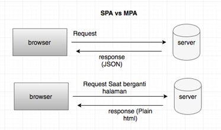
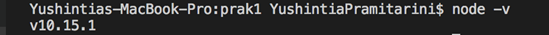

### Topik
- Pengenalan konsep Angular
- Instalasi Angular dan Node JS

### Tujuan
Mahasiswa diharapkan dapat:
1.	Memahami konsep Angular.
2.	Melakukan instalasi angular dan nodeJS

### Pendahuluan

Angular JS pertama kali dikembangkan oleh Misko Hevery dan Adam Abrons pada tahun 2009. Namun pada saat ini framework JavaScript dikembangkan atau dibangun oleh tim Google. AngularJS adalah open source sehingga dapat dikembangkan oleh siapa saja. Angular JS adalah Framework terstruktur untuk aplikasi web yang dinamis.
Framework ini mendukung penggunaan HTML sebagai template dan memberikan keleluasaan pada pengembang untuk mengekspresikan komponen dari aplikasi yang dibuat secara baik dan ringkas. AngularJS menggunakan metode MVC (Model View Controller) yang membuat source code dari aplikasi yang dibuat menjadi lebih mudah untuk dikembangkan. Data Binding dan dependency injection dapat mengeliminasi banyak code yang akan ditulis. Semuanya dibebankan kepada web browser sehingga membuatnya menjadi partener ideal dengan teknologi server. Angular JS digunakan untuk membangun aplikasi yang bersifat Single Page Application (SPA). Single Page Application merupakan aplikasi yang menggunakan utilitas penuh di browser yang tidak membutuhkan reload atau pergantian halaman dengan cara merequest ke server. Sedangkan Multipage Application membutuhkan request ke server dan server mereturn berupa HTML ke Browser artinya setiap perpindahan halaman pada multipage application membutuhkan reuqest dari client ke server. Single Page Application biasanya melakukan request ke server selain mendapatkan initial file (js/html/css) juga mendapatkan data berupa JSON yang berfungsi sebagai data untuk komponennya.

**Gambar 1. Single Page Application vs Multipage Application**

##### Fitur Utama AngularJS :
- Data binding :  Sinkronisasi data seraca otomatis antara komponen model dan view.
- Scope / Lingkup : Merupakan obyek yang mengacu pada model. Mereka bertindak sebagai lem antara controller dan View.
- Controller : Merupakan fungsi javascript yang terikat pada lingkup tertentu.
-	Services / Layanan : AngularJS datang dengan beberapa built-in services misalnya $http untuk membuat XMLHttpRequests. Ini adalah objek tunggal yang dipakai hanya sekali diapp.
-	Filter− Pilihan subset dari item dari array dan mengembalikan array baru.
-	Directives / Arahan : Adalah tanda-tanda pada elemen DOM (seperti elemen, atribut, css, dan lain – lain). Ini dapat digunakan untuk membuat kustom tag HTML yang berfungsi sebagai widget baru, kustom. AngularJS memiliki built-in arahan (ngBind, ngModel…)
-	Templates : Adalah View yang diberikan dengan informasi dari controller dan model. Terdapat beberapa view dalam satu halaman, menggunakan “parsial” atau file tunggal (seperti index.html).
-	Routing :  Merupajan konsep View switching.
-	Model View Whatever : Apapun MVC adalah pola desain untuk membagi aplikasi menjadi bagian yang berbeda (disebut Model, View dan Controller), masing-masing dengan tanggung jawab yang berbeda. AngularJS tidak melaksanakan MVC dalam arti tradisional, tetapi agak sesuatu lebih dekat ke MVVM(Model-View-ViewModel).
-	Deep Linking : Deep menungkinkan  menghubungkan Anda untuk menyandikan keadaan aplikasi dalam URL sehingga ia dapat bookmarked. Aplikasi kemudian dapat dikembalikan dari URL ke negara yang sama.
-	Dependency Injection : AngularJS memiliki built-inketergantungan injeksi subsistem yang membantu pengembang dengan membuat aplikasi lebih mudah untuk mengembangkan, memahami, dan menguji.

**Praktikum – Bagian 1: Instalasi NodeJS**

| **Langkah** | Keterangan |
|---|-----|
|1| Download NodeJS pada link berikut : [Node JS](https://nodejs.org/en/) | 
|2| Install nodeJS yang sudah di download pada langkah 1 | 
|3| Ketik perintah berikut : `node –v`  | 
|4| Catat hasilnya (soal 1)  |
